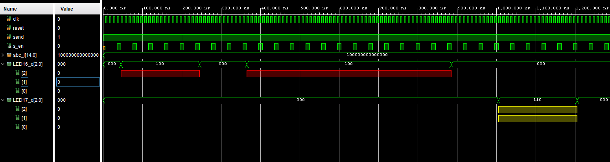
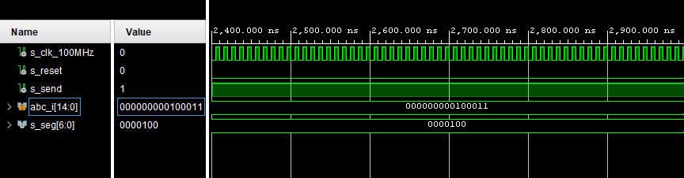
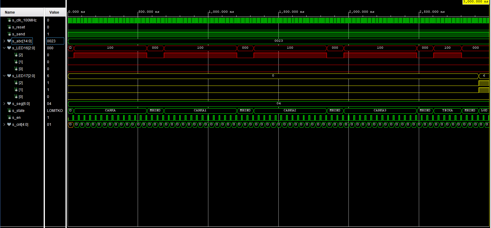

# Project_Morse
# Morse transmitter
### Team members

* Fiala Marek
* Neradilek Adam
* Nesvadba Ondřej
* Peška Vojtěch

### Table of contents

* [Project objectives](#objectives)
* [Characters distribution](#characters)
* [State diagram](#states)
* [Hardware description](#hardware)
* [VHDL modules description and simulations](#modules)
* [TOP module description and simulations](#top)
* [Video](#video)
* [Conclusion](#conclusion)
* [References](#references)

## Project objectives
The main objective of our project is to program a VHDL code, which transfers any digit or letter from czech alfabet into morse code. Then implement our code via Vivado to Nexys-a7-50t board and transmit chosen character via RGB LED. 

The characters (digits or letters) are assigned by 15 switches on the Nexys board. The way characters are assigned is described in a table below. As soon as character is assigned, you can switch the left switch (SW[15]) and entered character is in morse trasmitted via RGB LED. Pushing the center button resets the transmission. During the transmission, the switches are inactive and you can enter another character after the transmission is finished.

The transmission is done via states. Each state has defined output value for RGB LEDs.

## Characters distribution

## State diagram

Five different types of states are defined: MEZERA, TECKA, CARKA, LOMITKO, SMYCKA. Initial state is MEZERA and depending on selected character the program changes state to TECKA or CARKA, putting MEZERA in between every TECKA or CARKA state. State LOMITKO is used to tell user the character transmission finihsed. Program ends in SMYCKA state and waits for another input.

### State diagram for character "A"

## Hardware description

Nexys A7 Artix-7

The Nexys A7 board is a complete, ready-to-use digital circuit development platform based on the latest Artix-7™ Field Programmable Gate Array (FPGA) from Xilinx®. With its large, high-capacity FPGA, generous external memories, and collection of USB, Ethernet, and other ports, the Nexys A7 can host designs ranging from introductory combinational circuits to powerful embedded processors. Several built-in peripherals, including an accelerometer, temperature sensor, MEMs digital microphone, a speaker amplifier, and several I/O devices allow the Nexys A7 to be used for a wide range of designs without needing any other components.

## VHDL modules description and simulations

### morse.vhd
Module morse.vhd has defined states (MEZERA, TECKA, CARKA, LOMITKO, SMYCKA). States MEZERA, TECKA and CARKA each have more identical states (MEZERA, MEZERA1, MEZERA2, etc...) due to the functionality of the program. Furthermore four different time constants (0s; 0.5s; 1s; 3s) and four different colour constants (RED, YELLOW, GREEN, BLUE) are defined. The output and input signals are defined as well. 

In p_morse process each character selection has unique state diagram, defined according to a morse code. Since every character in morse requires at least two MEZERA states (most require also multiple CARKA and TECKA states), the program needs six identical states with different names, because the program cannot go back to the same state and continue in a different path. Every character has initial state MEZERA, after clock counts to 0.5s state swithes to TECKA or CARKA, after clock counts to the defined time (1s for TECKA, 3s for CARKA), state switches to MEZERA1, etc... At the end of each transmission state is switched to LOMITKO for 1s, which tells user that character transmission in finished, then the state switches to SMYCKA which keeps on repeating until user sends another character.

Every state has defined outputs for both RGB LEDs.

### hex_7seg.vhd
Module hex_7seg.vhd displays currently selected character on seven-segment display. Selected character on switches is used as an input. Process 7_seg_decoder selects which case is currently selected and outputs signal into the seven-segment display.

### clock_enable
Module clock_enable is used in order for the program not to react to every rising edge of internal clock.

### Simulation for character "9"

## TOP module description

## Video

https://user-images.githubusercontent.com/99417291/166517196-2f939805-5b81-43a1-9c3d-45fd9d4b70a7.mp4

## Conclusion

In conclusion, we were not able to fulfill the project objectives, as the program cannot transmit chosen letter or number in morse code via RGB LED. We are, however, able to transmit one chosen character, as it is shown in the simulation waves above. For the transmission, we are using state automat. The main problem of our project is the fact, that every state has to be unique and the program cannot go back to the same state and continue in a different path, therefore we would have to define too many states. Another problem in our code is the way, how to implement the selection of a character. We use "case" function in our code, but it is not working implemented on the Nexys board. 

## References

1. https://cs.wikipedia.org/wiki/Morseova_abeceda
2. https://github.com/tomas-fryza/digital-electronics-1
3. https://digilent.com/reference/programmable-logic/nexys-a7/reference-manual?redirect=1
4. https://en.wikichip.org/wiki/seven-segment_display/representing_letters
5. https://forum.digikey.com/t/debounce-logic-circuit-vhdl/12573
